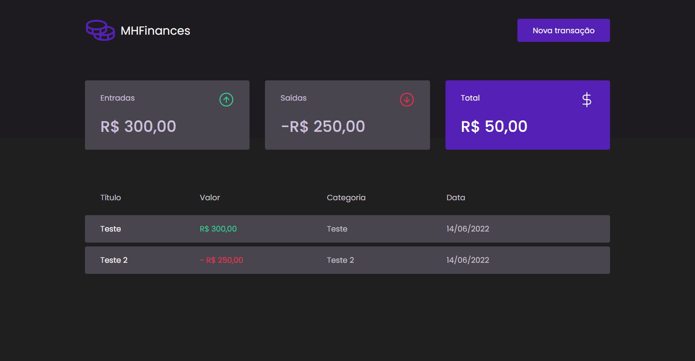

<div align="center">
  <h1>MHFinances</h1>
</div>

<p align="center">
  Aplicação de gestão financeira que consume uma fake API.
</p>

<p align="center">
  <a href="#features">Features</a> -
  <a href="#pré-requisitos">Pré requisitos</a> -
  <a href="#rodando-a-aplicação">Rodando a aplicação</a> -
  <a href="#tecnologias">Tecnologias</a> -
  <a href="#autor">Autor</a>
</p>

<br>

# Features

- [x] Botão que abre um modal para adicionar uma nova transação.
- [x] Escolher o título e a categoria da transação.
- [x] Escolher se a transação é um valor de entrada ou saída.
- [x] Calcula o total de finanças de acordo com as transações.
- [x] Valores refletidos em tela.
- [x] Deletar uma transação.

<br>

# Demo 🎥

<h1 align="center">
  
</h1>

## Pré requisitos

Você vai precisar ter instalado na sua máquina as seguintes ferramentas:

- [GIT](https://git-scm.com/download/)
- [Node.JS](https://nodejs.org/en/download/)

É indicado ter instalado o [Visual Studio Code](https://code.visualstudio.com/download) para edição do código.

---

## Rodando a aplicação

```bash
# Clone o repositório
git clone https://github.com/matheusbrauna/mhfinances.git

# Entre na pasta do projeto
cd mhfinances

# Rode o projeto
npm i
npm run dev

# Caso vc use o yarn
yarn
yarn dev

# O servidor será iniciado na porta :3000 - acesse: <http://localhost:3000>
```

## Tecnologias

- [ReactJS](https://pt-br.reactjs.org/)
- [styled-components](https://styled-components.com/)
- [phosphor-icons](https://phosphoricons.com/)
- [Polished](https://polished.js.org/)
- [Node.JS](https://nodejs.org/)
- [Axios](https://axios-http.com/ptbr/docs/intro)
- [MirageJS](https://miragejs.com/)

---

## Autor

Feito por Matheus Henrique 🚀 [Link do meu LinkedIn](https://www.linkedin.com/in/matheus-brauna-dev/)
